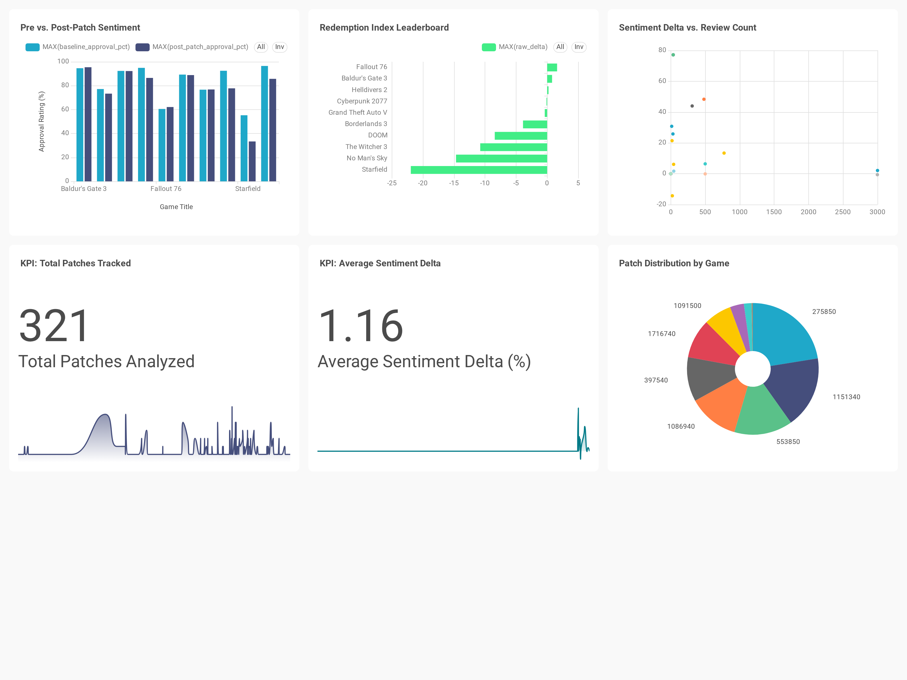

# Lazarus 

We've all seen it happen: a game launches completely broken, gets trashed by players, and months later the developers release a massive update claiming everything is fixed. Everyone on the internet immediately says the game had a huge comeback, but I wanted to know if that was actually true or just hype.

Can a single patch really save a broken game? Instead of relying on forum opinions and vibes, I built this project to track real Steam reviews and mathematically prove whether major updates actually turn player sentiment around.

## Project Structure

```text
steam-lifecycle-analysis
|-- .github
|-- .venv
|-- .vscode
|-- data
|-- notebooks
|-- scripts
|-- sql
```


## System Architecture

1. Extraction: Python scripts interface with the Steam API to pull raw user reviews and historical patch events.
2. Transformation and Load (ETL): Data is cleaned, typed, and structured using pandas, then loaded into a cloud-hosted PostgreSQL database (Supabase) via SQLAlchemy.
3. Statistical Modeling (SQL): A two-proportion Z-test evaluates the 30-day post-patch sentiment delta against the lifetime baseline approval rating, calculating statistical significance to eliminate small-sample bias.
4. Visualization: A Dockerized Apache Superset instance connects to the Supabase connection pooler to serve interactive business intelligence dashboards.

## Dashboard: Steam Redemption Index

Interactive Business Intelligence dashboard built with Apache Superset (Preset), visualizing the statistical impact of game updates on player sentiment over time. 



*Key Metrics Tracked:*
* **Pre vs. Post-Patch Sentiment:** Grouped bar chart comparing a game's lifetime baseline approval against its 30-day post-update reception.
* **Redemption Index Leaderboard:** Horizontal bar chart ranking titles by their total sentiment shift (`raw_delta`).
* **Sentiment Delta vs. Review Volume:** Scatter plot isolating high-impact community shifts from low-sample statistical noise.
* **Patch Distribution:** Donut chart breaking down update frequency across the 321 tracked patches.
* **Topline KPIs:** High-level metrics tracking total analyzed updates and global average sentiment shifts.

## Challenges and Solutions

* Overcame Docker's native IPv6 network limitations by routing the local Superset container through a Supabase IPv4 connection pooler.
* Addressed silent SQLAlchemy database rollbacks and accidental cloud table truncations by enforcing strict transaction commits and locking down schema structures.
* Bridged the gap between scraped recent reviews and historical patch dates by injecting synthetic test dates to validate the data pipeline's functionality.
* Eliminated small-sample bias by replacing basic percentage comparisons with a Two-Proportion Z-Test in SQL to mathematically verify if a game's comeback was statistically significant.

## Local Setup

1. Clone the repository.
2. Install dependencies via requirements.txt.
3. Run the ETL pipeline scripts to populate the database.
4. Launch Docker containers for Superset visualization.